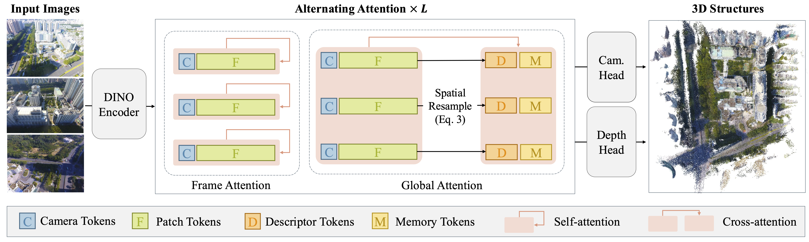

<p align="center">

  <h1 align="center">FlashVGGT: Efficient and Scalable Visual Geometry Transformers with Compressed Descriptor Attention</h1>
  <h3 align="center">CVPR 2026</h3>
  <p align="center">
    <a href="https://wzpscott.github.io/">Zipeng Wang</a>
    ·
    <a href="https://www.danxurgb.net/">Dan Xu</a>
  </p>

  <div align="center">
    <a href="https://arxiv.org/pdf/2512.01540"></a>
    <a href="https://arxiv.org/abs/2512.01540"></a>
    <a href="https://wzpscott.github.io/flashvggt_page/"></a>
  </div>
</p>


https://github.com/user-attachments/assets/3347dbe0-f3c0-48d3-9611-1516b59fbf94

<p align="center">
  <strong>TL;DR:</strong> <em>Accelerate VGGT by spatially resampling keys and values for global attention.</em>
</p>
<br>

## Updates 
- [05/02/2026] Evaluation code is released.
- [05/02/2026] Training code (both single-forward and streaming settings) is released.
- [05/02/2026] Code and checkpoints for FlashVGGT are released.

## Overview
<p align="center">
  <a href="">
    
  </a>
</p>
Instead of applying dense global attention across all tokens, FlashVGGT compresses spatial information from each frame into a compact set of descriptor tokens. Global attention is then computed as cross-attention between the full set of image tokens and this smaller descriptor set, significantly reducing computational overhead. Moreover, the compactness of the descriptors enables online inference over long sequences via a chunk-recursive mechanism that reuses cached descriptors from previous chunks. 

## Installation
### Environment Setup
First, you should clone the repository and create an anaconda environment.
```bash
git clone https://github.com/wzpscott/FlashVGGT.git
cd FlashVGGT
conda create -n flashvggt python=3.10 -y
conda activate flashvggt
```

Then,  You can use the following command to install the dependencies.
```bash
pip install -r requirements.txt
```

You can also install FlashVGGT as a package.
```bash
pip install -e . --no-deps
```

### Checkpoints
You can download the checkpoints for single-forward and streaming variants of FlashVGGT from the [HuggingFace](https://huggingface.co/ZipW/FlashVGGT). You should download the checkpoints to the `ckpts` folder.

```bash
# Create the checkpoints directory
mkdir -p ckpts

# Download the standard model
huggingface-cli download ZipW/FlashVGGT flashvggt.pt --local-dir ckpts

# Download the streaming model
huggingface-cli download ZipW/FlashVGGT flashvggt_stream.pt --local-dir ckpts
```

## Quick Start
We provide a demo script `demo_o3d.py` to visualize the 3D reconstruction results as point clouds using Open3D. The output is a `.ply` file that can be easily visualized with most 3D viewers.

### Usage Examples

#### Standard FlashVGGT Inference:
To run the standard FlashVGGT model on a folder of images:
```bash
python demo_o3d.py \
    --model FlashVGGT \
    --image_folder ./examples/garden/ \
    --output_dir outputs/
```

#### Streaming FlashVGGT Inference:
To run the streaming variant (FlashVGGTStream) which is optimized for longer sequences:
```bash
python demo_o3d.py \
    --model FlashVGGTStream \
    --image_folder ./examples/garden/ \
    --chunksize 10 \
    --output_dir outputs/
```

<details>
<summary><b>Key Arguments</b></summary>

- `--model`: Choose between `FlashVGGT` (single-forward) and `FlashVGGTStream` (streaming inference). Default is `FlashVGGT`.
- `--image_folder`: Path to the directory containing input images. Default is `./examples/garden/`.
- `--output_dir`: Directory where the generated `.ply` point cloud will be saved. Default is `outputs/`.
- `--chunksize`: Frame chunk size for `FlashVGGTStream` streaming inference. Default is `10`.
- `--max_points`: Maximum number of points to include in the output point cloud. Default is `1000000`.
- `--conf_threshold`: Percentage of low-confidence points to filter out (0-100). Default is `40.0`.
- `--kv_downfactor`: KV downfactor for attention compression. Default is `4`.
- `--keyframe_every`: Keyframe interval for the standard FlashVGGT model. Default is `200`.

</details>

## Training

The training code for FlashVGGT (both single-forward and streaming settings) is available in the `training` branch. Please refer to the [Training README](https://github.com/wzpscott/FlashVGGT/blob/training/training/README.md) for detailed instructions on installation, dataset preparation, and training commands.

## Evaluation
The evaluation code is based on [MonST3R](https://github.com/Junyi42/monst3r/blob/main/data/evaluation_script.md) and [CUT3R](https://github.com/CUT3R/CUT3R). 

You can use the following command to evaluate the model.
```bash
python eval.py --config-name dense_recon num_frames=100 save_name=dense_recon_100
python eval.py --config-name dense_recon num_frames=500 save_name=dense_recon_500
python eval.py --config-name dense_recon num_frames=1000 save_name=dense_recon_1000
```

The evaluation results are saved in the `eval/logs/dense_recon` folder.

## Acknowledgements
Our code is based on the following awesome repositories:
- [VGGT](https://github.com/facebookresearch/vggt)
- [FastVGGT](https://github.com/mystorm16/FastVGGT)
- [StreamVGGT](https://github.com/wzzheng/streamvggt)
- [CUT3R](https://github.com/CUT3R/CUT3R)
- [TTT3R](https://github.com/Inception3D/TTT3R)

We thank the authors for releasing their code!

## Citation
If you find our work useful, please cite:
```bibtex
@inproceedings{wang2025flashvggt,
  title={FlashVGGT: Efficient and Scalable Visual Geometry Transformers with Compressed Descriptor Attention},
  author={Wang, Zipeng and Xu, Dan},
  journal={Proceedings of the IEEE/CVF Conference on Computer Vision and Pattern Recognition},
  year={2026}
}
```
